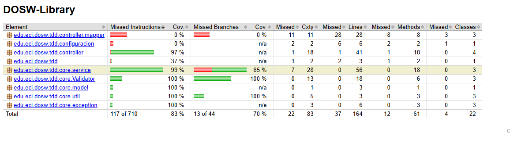
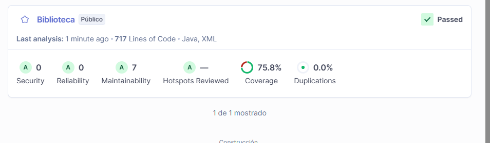
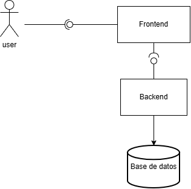

## Libreria

### Analisis de cobertura de pruebas
- Este documento contiene en analisis de las cobertura de las pruebas

### jacoco
- informe generado mediante Maven para la verificacion de la calidad de las pruebas
sonarqube

### sonarqube
-Análisis estático del código fuente realizado con SonarQube, evaluando métricas de calidad como bugs, code smells, vulnerabilidades y deuda técnica.

## Diagramas

### Diagrama de componentes general

### Diagraqma de componetnes especifico

